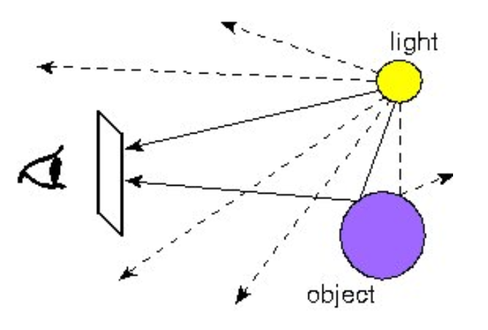
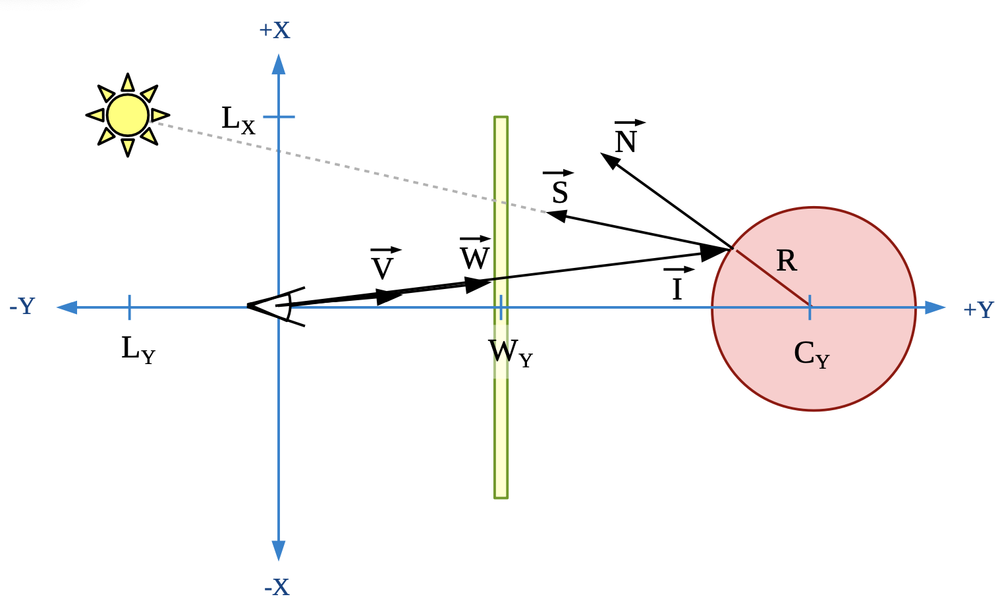
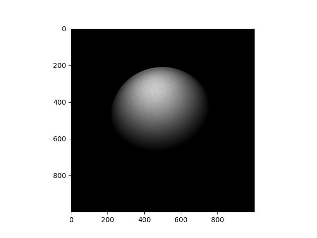
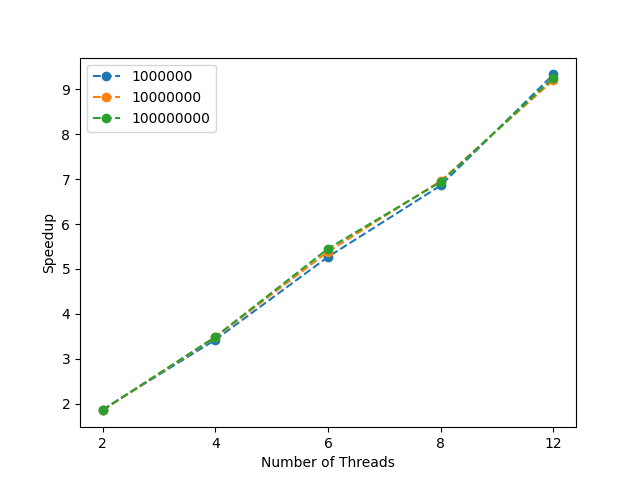
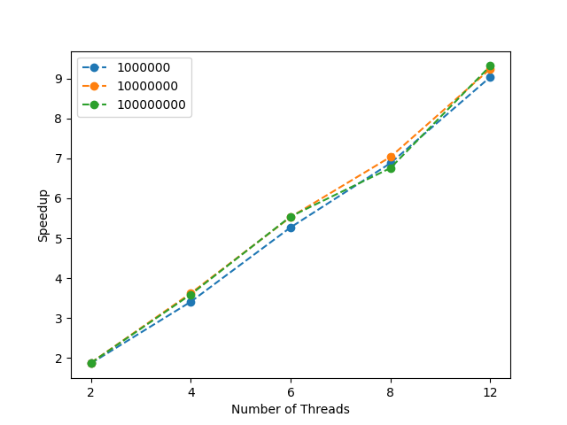
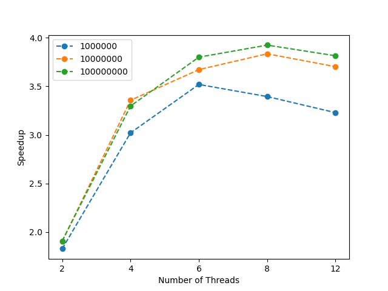
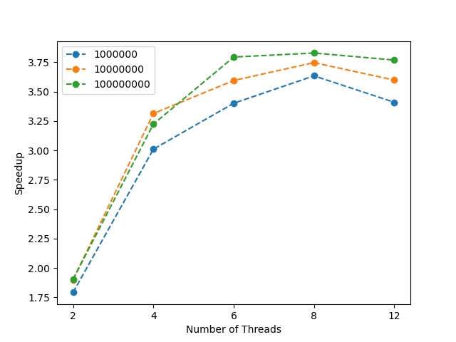

# Project 3 Report

ywang27@uchicago.edu

## 0 Introduction

This is the report for the project 3 for Parallel Programming, including problem detailed description, implementation, guide to run the system, speedup experiment and analysis, and discussions. **The problem that the system solves comes from a project of the course MPCS 51087-1 High Performance Computing that I enrolled for the quarter Spring 2022.** 

## 1 Problem Description

### 1.1 Ray Tracing

The problem that the system tries to solve is called **Ray Tracing**, a powerful method for rendering three-dimensional objects with complex light interactions. The figure below shows the basic idea. 



An observer (the eyeball) is viewing an object through a window (the rectangle). The object is illuminated by a light source, which is emitting rays of light (the arrows) in many directions. The observer will see rays that reflect off of the object. **In our system, we tried to render a 3D reflective sphere illuminated by a single light source** **by simulating the rays starting from the observer and going backwards to the light source.**

### 1.2 Theory

The figure below shows a 2D cross-section of the problem. The observer is at the origin and faces the positive $y$-direction. The sphere is located at $\vec{C}$ and has radius $R$. The window is parallel to the $(x,z)$-plane at $y = W_y$ and has bounds $−W_{max} < W_x < W_{max}$ and $−W_{max} < W_z < W_{max}$. In the simulation, the window is represented as an $n*n$ grid, $G$, and the light source is located at $\vec{L}$.



Simulation of a view ray consists of the following steps

- **Selecting direction of view ray.** Let $\vec{V}$ be a unit vector representing the direction of the view ray. In spherical coordinates, randomly select its component angles $(\theta, \phi)$. Then we will get $\vec{V}$ in Cartesian coordinates:
  $$
  V_X=\sin\theta\cos\phi\\
  V_Y=\sin\theta\sin\phi\\
  V_Z=\cos\theta
  $$
  To sample the unit sphere correctly without biasing the distribution, we sample $\phi$ from a uniform distribution between 0 and $2\pi$, and sample $\cos\theta$ from a uniform distribution between -1 and 1.

- Find the intersection of the view ray with the window. Since the window is at $W_Y$, the window's intersection with the view ray is
  $$
  \vec{W}=\frac{W_Y}{V_Y}\vec{V}
  $$
  View rays that do not intersect with the window ($|W_X|>W_{max}$ or $|W_Z|>W_{max}$) are rejected.

- Find the intersection of view ray with the sphere. Let $\vec{I}$ be the intersection of the sphere with the view ray. Solving the following equations
  $$
  \vec{I}=t\vec{V}\\
  |\vec{I}-\vec{C}|^2=R^2
  $$
  yields
  $$
  t=(\vec{V}·\vec{C})-\sqrt{(\vec{V}·\vec{C})^2+\vec{R}^2-\vec{C}·\vec{C}}
  $$
  which could be used to get $\vec{I}$. View rays that do not have a real solution for $t$ are rejected.

- Find the observed brightness of the sphere.Let $b$ be the brightness of the sphere observed at the position of $\vec{I}$. 

  - Find the unit normal vector. The unit normal vector $\vec{N}$ is perpendicular to the sphere’s surface at $\vec{I}$. 
    $$
    \vec{N}=\frac{\vec{I}-\vec{C}}{|\vec{I}-\vec{C}|}
    $$

  - Find the direction to the light source. The direction to light source is represented by the unit vector $\vec{S}$
    $$
    \vec{S}=\frac{\vec{L}-\vec{I}}{|\vec{L}-\vec{I}|}
    $$

  - Find the brightness. According to Lambertian shading
    $$
    b=\max(\vec{S}·\vec{N}, 0)
    $$

- Accumulate brightness to the window's grid. Find $(i, j)$ such that $G(i, j)$ is the position of $\vec{W}$ on the window's grid $G$
  $$
  G(i,j) = G(i,j)+b
  $$

### 1.3 Work Decomposition

The system follows a similar work style of CUDA in rendering objects, that it decompose the work by assigning each thread a part of light rays. The fact that each light is independent of others makes it especially suited to be parallelized by multiple threads. Each thread works on a part of the lights and accumulate the lights to the position of window grid atomically. 

## 2 Implementation

### 2.1 Linked-list based Unbounded DEQueue

The linked-list based unbounded dequeue is implemented in `unbounded.go`. A new method `Size()` is added to the interface `DEQueue`. Two internal data structures are defined. One is the node in the queue that stores the actual generic task that should be run

```go
type node struct {
	task Task
	prev *node
	next *node
}
```
The other is the actual dequeue as a coarse-grained concurrent linked-list

```go
type dequeue struct {
	mtx  sync.Mutex
	head *node
	tail *node
	size int
}
```

The `NewUnBoundedDEQueue()` returns a `dequeue` with only two connected nodes: head and tail

```go
dq.head.next = dq.tail
dq.tail.prev = dq.head
```

The methods in the interface are implemented as coarse-grained by locking and unlocking the mutex before accessing and modifying the linked-list. To handle ABA problem, every time a new task is pushed into the queue a new node is created and linked to the end of the list. The logic for poping a task from the top and the end of the queue is quite straightforward so please directly refer to the code.

### 2.2 Future

#### 2.2.1 Definition

The future stores a task and its result (if available). When the thread calls its `Get()` method, the future returns the result immediately if the result is ready or blocks until the result it ready. The Channel in Go provides a similar concept so I use it as part of the implementation of the future.

In order to implement future described above, a new data structure `TaskFuture` is defined in `concurrent.go`

```go
type TaskFuture struct {
	task     Task
	finished bool
	result   interface{}
	wait     chan bool
	wg       *sync.WaitGroup
}
```

- `task`: the actual task stored in the future
- `finished`: a boolean value indicating whether the result is ready
- `result`: the actual result that should be returned
- `wait`: a channel that used to block the future before its result is ready
- `wg`: wait group used for synchronization

#### 2.2.2 Execution

In `cocurrent.go` I implemented a function `executeFutureTask` that takes in a generic task with type `Task` and executes it as a `TaskFuture`. 

```go
func executeFutureTask(t Task){...}
```

In order to do this, first convert the input task to a `TaskFuture` via type assertion.

```go
ft, _ := t.(*TaskFuture)
```

Task could be either a `Runnable` or `Callable`, and they have different method to call to acutally execute the task. So the next step is to find the specific type of the task. If the task is a `Runnable`, call `Run()` otherwise call `Call()` and store the result into the future.

```go
newT, ok := ft.task.(Runnable)
if ok {
    newT.Run()
} else {
    newT, _ := ft.task.(Callable)
    ft.result = newT.Call()
}
```

After the task finishes running, the future should be notified by setting the `finished` to `True` and signal the `wait` channel

```go
ft.finished = true
ft.wait <- true
```

At last remove the task from the wait group for synchronization

```go
ft.wg.Done()
```

#### 2.2.3 Get

After managing the status of the future throughout its execution, the `Get()` is quite straighforward to implement. If the future's result is ready, then returns the result immediately. Otherwise blocks until the channel is notified and returns the result.

```go
func (t *TaskFuture) Get() interface{} {
	if t.finished {
		return t.result
	} else {
		<-t.wait
		return t.result
	}
}
```

### 2.3 Executor Service

#### 2.3.1 Definition

The following internal data stuctures is defined to implement the interface `ExecutorService`

First is a worker holding the dequeue to store tasks

```go
type worker struct {
	localQueue DEQueue
	peers      []*worker
	id         int
}
```

- `localQueue`: the actual dequeue interface
- `id`: the id of the worker
- `peers`: the id of other workers

Then the executor holding a group of workers


```go
type executor struct {
	capacity  int
	numTasks  int
	workers   []*worker
	wg        *sync.WaitGroup
	threshold int
}
```

- `capacity`: the capacity of the executor service, i.e., the number of workers
- `numTasks`: the number of submitted tasks to the executor
- `workers`: a group of workers that is going to hold the submitted tasks
- `wg`: wait group used for synchronization
- `threshold`: threshold for work balancing

The executor service is initialized and returned in `NewWorkStealingExecutor()` in `stealing.go` and in `NewWorkBalancingExecutor()` in `balancing.go`. I did not use `thresholdQueue` in my implementation.

#### 2.3.2 Submit

The function first creates a `TaskFuture` with no result and unfinished status, and `wg` as the wait group of the executor. Then the function adds 1 to the wait group of the executor, pushes the future to one of the worker's local dequeue by calling `PushBottom()`, and increments the number of tasks. Finally returns the created `TaskFuture`.

```go
se.wg.Add(1)
se.workers[se.numTasks%se.capacity].localQueue.PushBottom(&future)
se.numTasks++
```

#### 2.3.3 Shutdown

Simply waits on the wait group until all the futures have finished their running and got results.

```go
func (se *executor) Shutdown() {
	se.wg.Wait()
}
```

### 2.4 Work Stealing

The implementation for the work stealing strategy is in `stealing.go` in the following function

```go
func (w *worker) runWorkStealing() {...}
```

In function `NewWorkStealingExecutor()`, after the initialization of the executor service object, every worker runs the function a in new thread to start the service.

```go
for i := 0; i < capacity; i++ {
    go stealingExecutor.workers[i].runWorkStealing()
}
```

The function `runWorkStealing()` follows the implementation of work stealing in slides from M7 of the course. In a forever loop, the worker first tries to gather a task from the local queue by calling `PopTop()`. If the local queue is empty, it tries to steal a task from one of its random peer by calling `PopBottom()` on the victim's local queue.

Every time a task is gathered, `executeFutureTask()` is called to execute this task as a future, which is described in section 2.2.2.

### 2.5 Work Balancing

Similarly, the implementation for the work balancing strategy is in `balancing.go` in the following function

```go
func (w *worker) runWorkBalancing(threshold int) {...}
```

and after the initialization of the executor service object in  `NewWorkBalancingExecutor()`, every worker runs the function in a new thread to start the service.

```go
for i := 0; i < capacity; i++ {
    go stealingExecutor.workers[i].runWorkBalancing()
}
```

The function `runWorkBalancing()` follows the implementation of work balancing in slides and the java code from M7 of the course. In a forever loop, the worker first tries to gather a task from the local queue by calling `PopTop()`. It then checks the condition for rebalancing and if the condition is statisfied, the function `balancing()` is called to balance the tasks in the queues of two workers, passing their local dequeue interfaces, in an ascending order of the worker's id.

The function `balancing()` is defined in `unbounded.go`

```go
func balancing(q0 DEQueue, q1 DEQueue, threshold int)
```

It first compares the size of the two passed queue by calling `Size()` . If there difference is greater than the threshold, move the tasks until they are balanced by calling `PopTop()` on the larger queue and `PushBottom()` on the smaller queue

```go
for qMax.Size() > qMin.Size() {
    qMin.PushBottom(qMax.PopTop())
}
```

The implementation is slightly different from the java code, where the two queues are locked before they are balanced. Here we do not have access to lock the internal `dequeue` via the interface `DEQueue`. However, since the dequeue is implemented in concurrent data structure, every method to the interface `DEQueue`  that are called in `balancing()` are thread-safe to manage the queues and perform the balancing.

### 2.6 Parallel System Implementation

#### 2.6.1 Vector

The Ray Tracing involves a lot of computation on vectors. The package `vector` in  `vector.go` defined a data structure `Vector` and a series of vector operations that are used in the simulation.

#### 2.6.2 Subtask

Each subtask in the system is to simulate a part of rays and accumulate the brightness to a global grid atomically. In order to do this, `main.go` first defines a struct `SharedContext` shared by all the threads

```go
type SharedContext struct {
	numRays   int
	numGrid1d int
	grids     [][]float64
}
```

- `numRays`: number of light rays in total
- `numGrid1d`: size of grid along one dimension
- `grids`: 2-d slice representing the window

Then it defines a struct `RayTracingTask` implementing the interface `concurrent.Runnable`

```go
type RayTracingTask struct {
	ctx             *SharedContext
	randomGenerator *rand.Rand
}
```

- `ctx`: pointer of a global context shared by every tasks
- `randomGenerator`: a random generator for sampling light rays.

The function `NewRayTracingTask()` returns a new `RayTracingTask` by creating a new `rand.Rand` object from a new seed for each subtask and setting the `randomGenerator` field. Every subtask is required to have their own `randomGenerator` independent of each other's because the sampled light ray in each subtask should not be related.

```go
func NewRayTracingTask(ctx *SharedContext, seed int64) concurrent.Runnable {
	return &RayTracingTask{
		ctx:             ctx,
		randomGenerator: rand.New(rand.NewSource(seed)),
	}
}
```

To implement the `concurrent.Runnable`, the `RayTracingTask` implements `Run()` where the task simulates all the rays assigned to it

```go
func (t *RayTracingTask) Run() {
    for i := 0; i < t.ctx.numRays; i++ {
        // Code for simulation
    }
}
```

The simulation of a light ray follows the description in section 1.2. At the end of iteration, atomically add the brightness to the correct position of the grid in the global context

```go
utils.AtomicAddFloat64(&t.ctx.grids[iIndex][jIndex], b)
```

#### 2.6.3 Parallelism

To parallelize the system by work stealing/balancing, firstly create the context and compute the number of rays for each subtasks

```go
nRaysPerTask := int(nRays / nTasks)
ctx.numRays = nRaysPerTask
```

Then follow the examples given by `covid.go` and `pi.go`, create a group of subtasks by `NewRayTracingTask()`, submit them to the executor by `Submit()` and store the returned futures in a slice. The current unix time is used as the seed of the rand generator. Remember each subtask should have independent rand generator, so we increment the seed by 1 in iteration.

```go
for i := 0; i < nTasks; i++ {
    futures = append(futures, executor.Submit(NewRayTracingTask(&ctx, randSeed)))
    randSeed++
}
```

Lastly shutdown the executor after all the tasks have been submitted

````go
executor.Shutdown()
````

## 3 How to Run

### 3.1 Running Demos

In order to run the system for a demo

```sh
cd raytracing
go run main.go number_of_rays size_of_grid strategy number_of_threads number_of_subtasks
```

- `number_of_rays`: the number of simulated rays for the rendering. Recommended: 100000000

- `size_of_grid`: number of pixels along one dimension. Recommended: 1000
- `strategy`:
  - `s` - sequential
  - `ws` - work stealing
  - `wb` - work balancing
- `number_of_threads`: (only used when strategy is `ws` or `wb`) number of threads for parallel strategy
- `number_of_subtasks`: (only used when strategy is `ws` or `wb`) number of subtasks for the strategy to manage. Recommended: 1000

Running the command would generate a text file `output` under the same directory. To generate the visualization of the rendering

```sh
python render.py
```

This would generate a **`render.jpg`** under the same directory.

**For a good visualization effect,** **please use the recommended values for the command-line arguments**. The following command (work stealing on 4 threads, 1000 subtasks, 1e8 light rays and 1000*1000 pixels for grid) is recommended for you to run a demo and takes about 16 seconds to finish on my laptop

```sh
go run main.go 100000000 1000 ws 4 1000
```

and the generated `render.jpg` is as below after running the `render.py` script



### 3.2 Reproducing Speedup Plots

To reproduce the speedup experiment result, i.e., the speedup plots

```sh
python plot.py
```

This would generate a `speedup-ws.png` for work stealing a `speedup-wb.png` for work balancing.

## 4 Experiments

### 4.1 Results

For this section, all the experiments are run on the **linux server.**

Below are the plots for speedup experiments under the settings

- Number of light rays: 1e6, 1e7, 1e8
- Number of threads: 2, 4, 6, 8, 12

The number of tasks is 1000 for every experiment.

**Work Stealing**



**Work Balancing**



### 4.2 Analysis

The results indicate that both the work stealing strategy and work balancing strategy produce speedup compared to the sequential implementation. The effects of speedup are significant, almost linear to the number of threads, as well as almost not affected by the problem size (the number of rays). This is probably because the problem of ray tracing requires only one synchronization among the subtasks at the end of their work. Every subtasks get executed almost independently without having to wait for others so the speedup is obvious and stable. From the plots, I did not observe signficiant difference between the effiiciency of work stealing and work balancing. One of the possible reason is that the work stealing/balancing does not happen frequently because the number of subtasks is not that large to yield a lot of differences for the queues. 

## 5 Discussion

### 5.1 Challenges

There are three challenges throughout the whole project

- Implementing the Future and using it with `ExecutorService`. Although I understand the concept of Future, Go does not provide a Future module. Initially I tried to implement the future using a conditional variable, but then Channel come to my mind which is fundamentally equivalent to Future. Moreover, I also spent some time on understanding how the Future works with `ExecutorService` and the provided `covid.go` and `pi.go` offered great help. What makes this more challenging is that the interfaces have only a few functions and they are not allowed to be modified, so all the work must be arranged and adjusted to fit into the provided functions.
- Generic tasks and type assertions. For this project, all the work done by the parallel strategy are generic, making the implementation more abstract. The item generated and returned by `Submit()` is of type `Future` while the item stored in dequeue is of type `interface{}`. Type assertion must be used frequently and correctly to handle this problem. Moreover, type assertion also comes into play when examing the actual type of a Future to be a `Runnable` or `Callable`, which must be done to call their corresponding methods to execute the task.
- Random Generator for ray tracing. At first I use the same random generator for every subtask to generate random vectors. The result indicates that the generated vectors are same for every subtasks, giving incorrect results. Then I figured out the correct way of creating new random generators for every subtasks by calling `rand.New()`.

### 5.2 Hotspots and Bottlenecks

There are two hotspots/bottlenecks for the system

- The coarse-grained implementation of linked-list based dequeue. As introduced in section 2.1, this concurrent data structure is implemented in a coarse-grained way by locking and unlocking the entire data structure. Although this is reasonable, the implementation excludes the possibility that any two of the `PushBottom()`, `PopBottom()` and `PopTop()` are be executed in parallel. However, for an ideal dequeue for work stealing/balancing, we should also the possibilty for the `PushBottom()` and `PopBottom()` to be called by different threads in parallel.
- Modification to a shared data structure. Every threads are modifying a gloabl grid to accumulate brightness and we should use `sync.Mutex` or `sync.Atomic` to avoid race conditions. Using `sync.Atomic` gives better performance than `sync.Mutex`.

### 5.3 Limitations

#### 5.3.1 Implementation

As mentioned in section 5.2, from the perspective of implementation, the limitation for the system comes majorly from the two bottlenecks: the coarse-grained implementation of the concurrent linked-list based dequeue and the current operations to a shared data structure. 

#### 5.3.2 Hardware

From the perspective of hardware, the number of cores of the machine must be a source of limitation to the system. Data for generating the speedup plot in experiments are collected by running system on the linux cs machine, which has ample cores (at least > 12) for the system to be parallelized. Because the system requires few synchronization, the speedup effects are significant and very ideal.

To verify this, I rerun the speedup the experiments with the same configurations on my MacBook Pro with the following hardware specifications

- OS: Ventura 13.0.1
- Processor: Apple M1
- Cores
  - Pyisical: 8 (4 Performance + 4 Efficiency)
  - Logical: 8
- Memory: 8 GB

and it generates the following speedup plots

**Work Stealing**



**Work Balancing**



It could be seen that the speedup stops when the number of threads goes over 8, which is the number of logical cores on my laptop. It could also be seen that the speedup slows down the number of threads goes over 4, which is the number of performance cores on my laptop. This indicates that the Efficiency cores may not work same as the performance cores in Go.

#### 5.3.3 Choice of Number of Subtasks

Another interesting thing is the choice of number of subtasks, i.e., the size of a subtask. In all the above experiments, the number of tasks are set to 1000. Actually, the choice of number of tasks also impacts the performance of the system. 

To verify this, I run experiments with different number of subtasks with 4 threads and number of rays=1e7. The running times are summarized in the below table

| # Subtasks | WS    | WB    |
| ---------- | ----- | ----- |
| 10         | 1.834 | 1.820 |
| 100        | 1.573 | 1.564 |
| 1000       | 1.549 | 1.541 |
| 10000      | 1.541 | 1.568 |
| 100000     | 1.837 | 2.189 |

Results show that either too few or too many number of tasks would be a limitation to the system. This is quite reasonable. If there are too few tasks, there is no room for work stealing/balancing strategy to be effective. This is because every worker (dequeue) handles only a couple of subtasks and it is unlikely that one of the queue consumes all its tasks while there are still available ones in other queues. On the other hand, if there are too many tasks, although the work stealing/balancing happens frequently between the dequeues, the overhead of managing so many subtasks becomes larger and thus undermining the overall performance.

## 6 References

- Project description for the course MPCS 51087-1 High Performance Computing (Spring 22)
- Golang documentation
- https://levelup.gitconnected.com/build-your-own-future-in-go-f66c568e9a7a
- https://stackoverflow.com/questions/27492349/go-atomic-addfloat32

